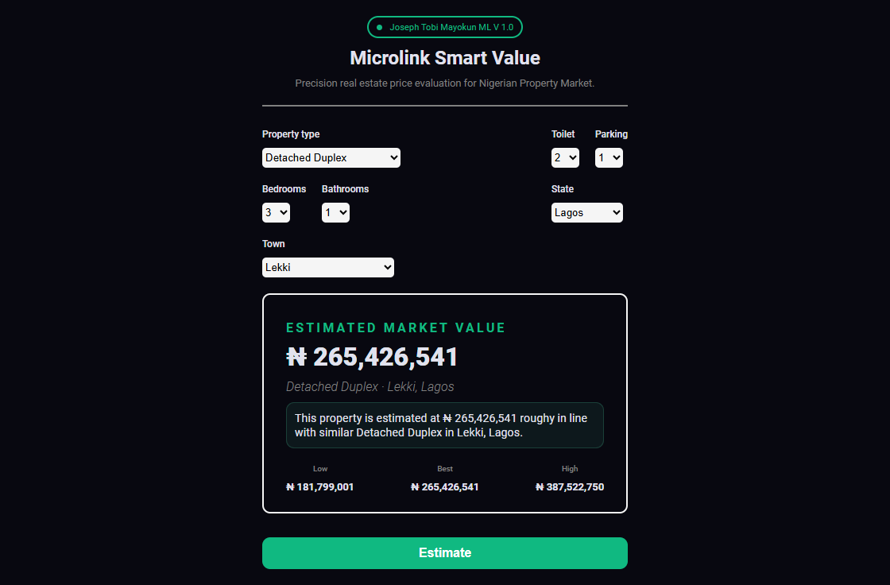
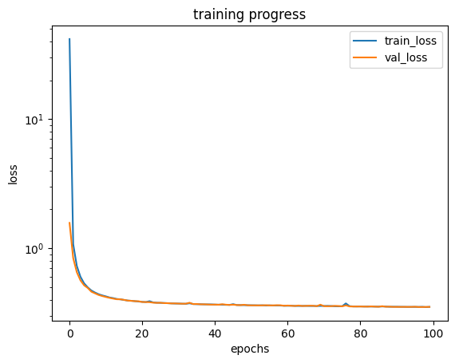

> Precision real estate price evaluation for the Nigerian Property Market.

**Live Demo:** [property-price-estimator-ecru.vercel.app](https://property-price-estimator-ecru.vercel.app)

---

## Screenshot





---

## Training Progress





The model converges cleanly with train and validation loss tracking closely,
confirming no overfitting across 100 epochs.

---

## Overview

NaijaHomes ML is a full-stack machine learning application that predicts 
property market prices across Nigeria. Given property attributes such as 
type, location, bedrooms, bathrooms, toilets, and parking, the model returns 
an estimated market value with a low/best/high confidence range.

Built as part of Microlink's mission to deliver AI-powered tools 
for African markets.

---

## Model Architecture

| Component        | Detail                        |
|------------------|-------------------------------|
| Framework        | PyTorch                       |
| Architecture     | MLP (Multi-Layer Perceptron)  |
| Hidden Layer     | 256 units, ReLU activation    |
| Output           | 1 unit (log-transformed price)|
| Regularization   | L2 Weight Decay (λ = 0.001)   |
| Avg. Val. Loss   | 0.393 (log-scale MAE)         |
| Training Epochs  | 100                           |
| Features         | ~226 (one-hot encoded)        |

**Target variable** is log-transformed to handle price skewness,
with predictions exponentiated back to Naira on inference.

---

## Features

- Predicts property prices across **36 Nigerian states**
- Supports multiple property types (Detached Bungalow, Duplex, Flat, etc.)
- Returns **Low / Best / High** price confidence range
- Sub-second inference via FastAPI backend
- Fully responsive React frontend

---

## Tech Stack

| Layer      | Technology                  |
|------------|-----------------------------|
| Frontend   | React 18, Vite, TailwindCSS |
| Backend    | FastAPI, Python             |
| ML         | PyTorch, Pandas, NumPy      |
| Deployment | Vercel (FE), Render (BE)    |

---

## Project Structure
naijahomes-ml/
├── frontend/         # React + Vite app
│   └── src/
│       └── App.jsx
├── backend/          # FastAPI server
│   ├── main.py
│   ├── model.py
│   ├── model.params
│   └── requirements.txt
└── README.md
---

## Local Setup

### Backend
```bash
cd backend
pip install -r requirements.txt
uvicorn main:app --reload
Frontend
cd frontend
npm install
npm run dev
Known Limitations
Training data is heavily Lagos-weighted (~77% of samples)
States with limited data are grouped for generalization
Model performs best on Lagos and Abuja properties
Author
Joseph Tobi Mayokun
Founder, Microlink | ML Engineer
GitHub ·
LinkedIn
